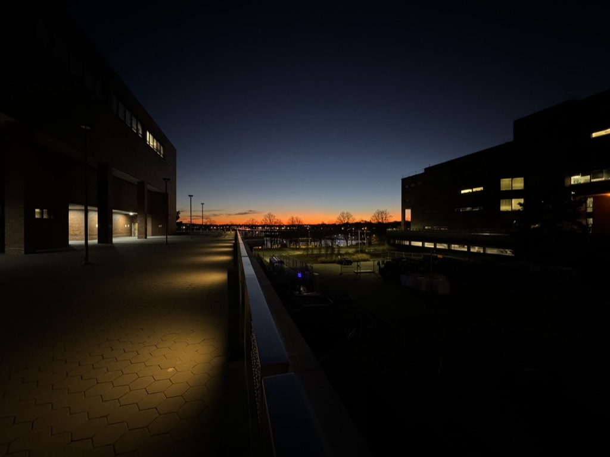
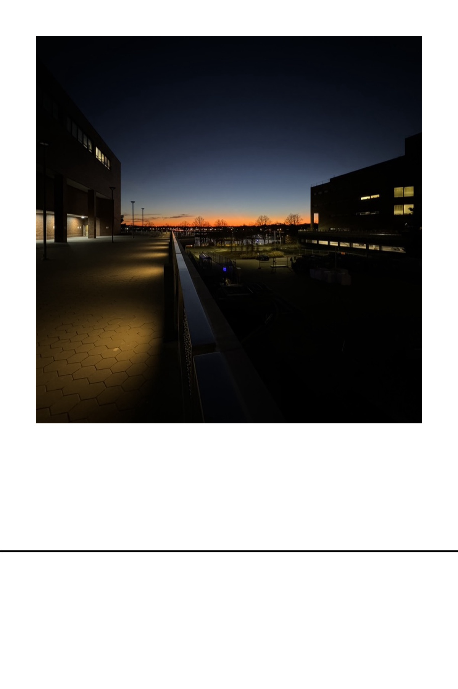

# Diy Polaroid

## Description

Edit your photos to look like polaroids when printed on common 4x6 photo paper. The app will make sure the photo has a 1:1 (square) aspect ratio, add a white border around the photo and add a black line at the bottom of the photo indicating where the paper should be cut to make it have the same aspect ratio as a polaroid.

## Instructions

### Recommended

-   Have all the photos you want to edit in a separate folder. The app will attempt to edit all the photos in the folder.
-   Have the photos already cropped to a 1:1 aspect ratio. The app will attempt to crop the photos to a 1:1 aspect ratio, but the results may not be as good if the subject is not centered.
-   The app will create a new folder called "polaroids" in the same location as the photos. The edited photos will be saved in this folder. If the folder already exists, the app will overwrite the photos in the folder.

### From the GUI (MacOS)

1. Download the app. (Click on the green "Code" button and then "Download ZIP")
2. Unzip the file.
3. Right-click on the app and select "Open with" -> "Terminal".
4. Click ok if a dialog box appears.
5. The app will ask for the path where the photos are located. Drag and drop the folder where the photos are located and press enter.

### From the terminal

1. Download the app. (Click on the green "Code" button and then "Download ZIP")
2. Unzip the file.
3. Open the terminal and navigate to the folder where the app is located.
4. Run the app with the following command: `./diypolaroid`
5. The app will ask for the path where the photos are located. Drag and drop the folder where the photos are located and press enter.

### Build from source

```bash
go build -o diypolaroid main.go
```

## Example

### Original photo



### Edited photo


